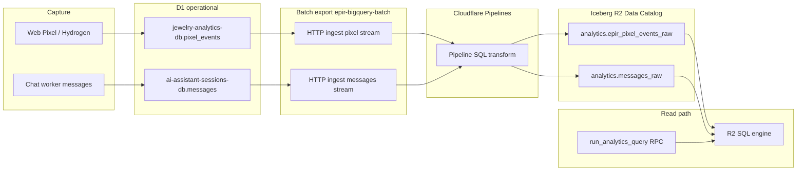

# EPIR Analytics Data Contract (kanon hurtowni pixel + czat)

## Cel i status

Ten dokument jest **wiążącym, szczegółowym kontraktem** warstwy danych analitycznych EPIR: od zapisu w D1, przez HTTP ingest Pipelines, po tabele Iceberg i odczyty **R2 SQL** (`run_analytics_query`, `Q1`–`Q10`).

- **Strażnik:** agent **EDCG** (EPIR Data Contract Guardian) — [`docs/kb/DATA_AND_ANALYTICS.md`](kb/DATA_AND_ANALYTICS.md) § EDCG, GitHub [`.github/agents/data-contract-guardian.agent.md`](../.github/agents/data-contract-guardian.agent.md).
- **Bramka kroków:** [`docs/merge-gates/WAREHOUSE_DATA_CONTRACT.md`](merge-gates/WAREHOUSE_DATA_CONTRACT.md) — każdy krok wymaga **`ESOG: PASS`** i **`EDCG: PASS`** przed kolejnym krokiem.
- **Ramy ogólne:** [`EPIR_DATA_SCHEMA_CONTRACT.md`](EPIR_DATA_SCHEMA_CONTRACT.md) (Shopify, D1 ogólnie, marketing namespace).
- **Implementacja SQL:** [`workers/bigquery-batch/src/analytics-queries.ts`](../workers/bigquery-batch/src/analytics-queries.ts).
- **Schematy JSON streamów Pipelines:** [`specs/schemas/`](../specs/schemas/) — w Cursorze jawny `@file` (katalog `specs/` poza indeksem domyślnym).

Jeden sklep Shopify (`SHOP_DOMAIN`), wiele storefrontów (`storefront_id`, `channel`, URL) — **nie** oznacza to jednej fizycznej bazy; oznacza **jeden opisany przepływ** i **jeden read model Iceberg**.

---

## Przepływ end-to-end



| Warstwa | Skrypt / zasób | Rola |
|---------|----------------|------|
| D1 pixel | `epir-analityc-worker` → `jewelry-analytics-db` | Źródło operacyjne zdarzeń |
| D1 chat | `epir-art-jewellery-worker` → `ai-assistant-sessions-db` | Wiadomości czatu |
| Batch | `epir-bigquery-batch` cron | Eksport przyrostowy do Pipelines |
| Iceberg | bucket `epir-analytics-iceberg-warehouse`, namespace `analytics` | Odczyt analityczny |
| R2 SQL | `epir-bigquery-batch` `BigQueryBatchS2SRpc` | Whitelist `queryId` |

Vars produkcyjne: [`workers/bigquery-batch/wrangler.toml`](../workers/bigquery-batch/wrangler.toml) — `WAREHOUSE_SQL_NAMESPACE`, `WAREHOUSE_SQL_PIXEL_TABLE`, `WAREHOUSE_SQL_MESSAGES_TABLE`.

---

## Reguły MUST (EDCG egzekwuje)

| ID | Reguła |
|----|--------|
| **D-01** | Odczyt R2 SQL (`analytics-queries.ts`, CQRS) używa **wyłącznie** kolumn z sekcji 4 (Iceberg read model). |
| **D-02** | W zapytaniach odczytu **zakaz** kolumn stream-only `url`, `payload` na tabeli Iceberg pixel. |
| **D-03** | **Zakaz** w SQL whitelist: `SELECT DISTINCT`, `COUNT(DISTINCT …)`; wymóg `GROUP BY` i `approx_distinct()` zgodnie z [R2 SQL limitations](https://developers.cloudflare.com/r2-sql/reference/limitations-best-practices/). |
| **D-04** | Każdy `queryId` (`Q1`–`Q10`) musi być zgodny z macierzą sekcji 5. |
| **D-05** | `session_id` w pixel i messages oznacza tę samą sesję lejka (`_epir_session_id` / atrybuty koszyka po stronie Shopify). |
| **D-06** | Zmiana mapowania w Cloudflare Pipelines **musi** być odzwierciedlona w repo: `pixel-pipeline-production.example.sql` i/lub tabela mapowania w tym dokumencie. |
| **D-07** | `analytics/dbt` i BigQuery są **legacy read path** — nie są źródłem prawdy dla `run_analytics_query`. |
| **D-08** | Nowa kolumna w Iceberg lub nowe pole w eksporcie batch wymaga aktualizacji tego dokumentu + CI `validate-data-contract.py`. |

---

## 1. D1 — `jewelry-analytics-db.pixel_events`

**DDL runtime:** [`workers/analytics/src/index.ts`](../workers/analytics/src/index.ts) — `ensurePixelTable` (nie mylić ze starszym [`schema-pixel-events-base.sql`](../workers/analytics/schema-pixel-events-base.sql), który może być nieaktualny).

### Kolumny operacyjne (wybór dla kontraktu)

| Kolumna D1 | Typ (runtime) | Semantyka | Eksport batch |
|------------|---------------|-----------|---------------|
| `id` | TEXT PK | Id zdarzenia | W `payload` JSON; w Iceberg jako kolumna top-level po pipeline |
| `event_type` | TEXT NOT NULL | Typ zdarzenia Web Pixel | Tak → stream `event_type` |
| `event_name` | TEXT | Nazwa szczegółowa | W `payload` |
| `created_at` | **INTEGER (ms epoch)** lub TEXT (ISO) | Czas zdarzenia | Tak → stream `created_at` (batch normalizuje do ISO); eksport przyrostowy: `CAST(created_at AS INTEGER) > watermark` |
| `customer_id` | TEXT | Shopify customer | Tak → stream |
| `session_id` | TEXT | Sesja lejka | Tak → stream |
| `storefront_id` | TEXT | np. kazka / zareczyny | Tak → stream |
| `channel` | TEXT | np. hydrogen-kazka | Tak → stream |
| `page_url` | TEXT | URL strony | Tak → stream jako **`url`**; puste w D1 → placeholder `https://epir.local/unknown` (schemat ingest wymaga non-empty `url`) |
| `page_title` | TEXT | Tytuł | W `payload` |
| `referrer` | TEXT | Referrer | W `payload`; Iceberg prod: często **`referrer_url`** |
| `product_id` | TEXT | Produkt | W `payload`; opcjonalnie top-level w Iceberg |
| `product_title` | TEXT | Tytuł produktu | W `payload` |
| `raw_data` | TEXT | JSON surowy | W `payload` |

Pozostałe kolumny (heatmap, scroll, cart, order, …) istnieją w D1 i trafiają do **`payload`** w eksporcie batch (`JSON.stringify` całego wiersza).

---

## 2. HTTP ingest — stream Pipelines (batch export)

**Kod:** [`workers/bigquery-batch/src/index.ts`](../workers/bigquery-batch/src/index.ts) — `exportPixelEvents`, `exportMessages`.

### Pixel stream (`epir_pixel_events_stream`)

Schemat: [`pixel-events-stream.schema.json`](../specs/schemas/pixel-events-stream.schema.json).

| Pole ingest JSON | Źródło D1 | Typ stream |
|------------------|-----------|------------|
| `event_type` | `event_type` | string |
| `session_id` | `session_id` | string |
| `customer_id` | `customer_id` | string |
| `storefront_id` | `storefront_id` | string |
| `channel` | `channel` | string |
| `url` | **`page_url`** | string |
| `payload` | **cały wiersz** `JSON.stringify(row)` | string |
| `created_at` | `created_at` | timestamp |

### Messages stream (`epir_messages_stream`)

Schemat: [`messages-stream.schema.json`](../specs/schemas/messages-stream.schema.json).

| Pole ingest | Źródło D1 `messages` | Typ stream |
|-------------|----------------------|------------|
| `id` | `id` | int64 |
| `session_id` | `session_id` | string |
| `role` | `role` | string |
| `content` | `content` | string |
| `timestamp` | `timestamp` | int64 (ms epoch) |
| `tool_calls` | `tool_calls` | string |
| `tool_call_id` | `tool_call_id` | string |
| `name` | `name` | string |
| `storefront_id` | `storefront_id` | string |
| `channel` | `channel` | string |

**D1 messages:** migracja [`workers/chat/migrations/001_create_analytics_schema.sql`](../workers/chat/migrations/001_create_analytics_schema.sql) + [`003_storefront_messages.sql`](../workers/chat/migrations/003_storefront_messages.sql).

---

## 3. Pipeline SQL (transform stream → sink)

**Prawda operacyjna w Cloudflare:** SQL pipeline w Dashboard / `wrangler pipelines get` — **nie** jest commitowany jako prod ID.

**Szablon kanoniczny w repo:** [`workers/bigquery-batch/pipelines-schemas/pixel-pipeline-production.example.sql`](../workers/bigquery-batch/pipelines-schemas/pixel-pipeline-production.example.sql).

### Mapowanie docelowe (Iceberg pixel) — kontrakt read model

| Kolumna Iceberg `analytics.epir_pixel_events_raw` | Źródło |
|---------------------------------------------------|--------|
| `id` | `payload` / D1 `id` (pipeline) |
| `session_id` | stream `session_id` |
| `event_type` | stream `event_type` |
| `page_url` | stream **`url`** (alias) |
| `referrer_url` | D1 `referrer` lub z `payload` |
| `customer_id` | stream |
| `storefront_id` | stream |
| `channel` | stream |
| `created_at` | stream `created_at` |
| `__ingest_ts` | metadata Pipelines/Iceberg (nie z batch) |

**Nie** zakładamy kolumny `payload` w Iceberg read model (odczyty R2 SQL jej nie używają).

Messages: domyślnie **1:1** ze streamu → `analytics.messages_raw` (te same nazwy pól).

---

## 4. Iceberg read model (R2 SQL)

Namespace: **`analytics`** (var `WAREHOUSE_SQL_NAMESPACE`).

### `analytics.epir_pixel_events_raw`

Kolumny **wymagane** przez whitelist (muszą istnieć w produkcji):

| Kolumna | Używane przez |
|---------|----------------|
| `session_id` | Q1, Q2, Q7, Q10 |
| `event_type` | Q1, Q2, Q4, Q5, Q7, Q8 |
| `created_at` | Q2, Q4, Q5, Q8, Q10 |
| `page_url` | Q4, Q5 |

Kolumny **opcjonalne** (pipeline / przyszłe presety):

| Kolumna | Uwagi |
|---------|--------|
| `id`, `referrer_url`, `customer_id`, `storefront_id`, `channel` | Obecne w prod / D1 |
| `product_id`, `product_title` | Q5 obecnie używa `page_url` jako proxy |

### `analytics.messages_raw`

| Kolumna | Typ logiczny | Używane przez |
|---------|--------------|----------------|
| `session_id` | string | Q1, Q6 |
| `role` | string | Q1, Q3, Q6, Q9 |
| `content` | string | Q3 |
| `timestamp` | int64 ms | Q1, Q3, Q6, Q9 — w SQL: `"timestamp"` |
| `name` | string | Q9 (role=tool) |

---

## 5. Macierz `queryId` (R2 SQL whitelist)

Implementacja: [`analytics-queries.ts`](../workers/bigquery-batch/src/analytics-queries.ts).  
ID: [`analytics-query-ids.ts`](../workers/bigquery-batch/src/analytics-query-ids.ts).

| queryId | Tabela pixel | Kolumny pixel | Tabela messages | Kolumny messages |
|---------|--------------|---------------|-----------------|------------------|
| **Q1_CONVERSION_CHAT** | tak | `session_id`, `event_type` | tak | `session_id`, `role` |
| **Q2_CONVERSION_PATHS** | tak | `event_type`, `session_id`, `created_at` | — | — |
| **Q3_TOP_CHAT_QUESTIONS** | — | — | tak | `content`, `role`, `timestamp` |
| **Q4_STOREFRONT_SEGMENTATION** | tak | `page_url`, `event_type`, `created_at` | — | — |
| **Q5_TOP_PRODUCTS** | tak | `page_url`, `event_type`, `created_at` | — | — |
| **Q6_CHAT_ENGAGEMENT** | — | — | tak | `session_id`, `role`, `timestamp` |
| **Q7_PRODUCT_TO_PURCHASE** | tak | `session_id`, `event_type` | — | — |
| **Q8_DAILY_EVENTS** | tak | `created_at`, `event_type` | — | — |
| **Q9_TOOL_USAGE** | — | — | tak | `name`, `role`, `timestamp` |
| **Q10_SESSION_DURATION** | tak | `session_id`, `created_at` | — | — |

**Dialekt:** wszystkie presety muszą przejść reguły **D-03** (test CI).

---

## 6. Legacy i inne ścieżki

| Ścieżka | Status |
|---------|--------|
| **BigQuery** `epir_jewelry` / dbt [`analytics/dbt`](../analytics/dbt/epir_warehouse/) | **Legacy** — opis „payload/url” w dbt **nie** definiuje Iceberg read model |
| **Marketing Iceberg** `marketing.*` | Osobny namespace — [`EPIR_DATA_SCHEMA_CONTRACT.md`](EPIR_DATA_SCHEMA_CONTRACT.md) |
| **CQRS** `epir-analityc-worker` | [`r2-warehouse-query.ts`](../workers/analytics/src/cqrs/r2-warehouse-query.ts) — ten sam dialekt R2 (`approx_distinct`) |

---

## 7. Weryfikacja operatorska (poza git)

Po zmianie pipeline lub sink:

```bash
wrangler r2 sql query epir-analytics-iceberg-warehouse --database <CATALOG> \
  --command "DESCRIBE analytics.epir_pixel_events_raw"
```

Porównaj wynik z sekcją 4. Jeśli `DESCRIBE` ≠ kontrakt → zaktualizuj sekcję 3–4 i example SQL, potem **EDCG** recenzja.

CI w repo: `python scripts/ci/validate-data-contract.py` (kolumny zabronione w SQL, brak DISTINCT).

---

## 8. Powiązane dokumenty

- [`EPIR_DEPLOYMENT_AND_OPERATIONS.md`](EPIR_DEPLOYMENT_AND_OPERATIONS.md) — deploy, troubleshooting R2 SQL
- [`workers/bigquery-batch/pipelines-schemas/README.md`](../workers/bigquery-batch/pipelines-schemas/README.md) — tworzenie streamów/sinków
- [`merge-gates/WAREHOUSE_DATA_CONTRACT.md`](merge-gates/WAREHOUSE_DATA_CONTRACT.md) — kroki i PASS ESOG+EDCG
