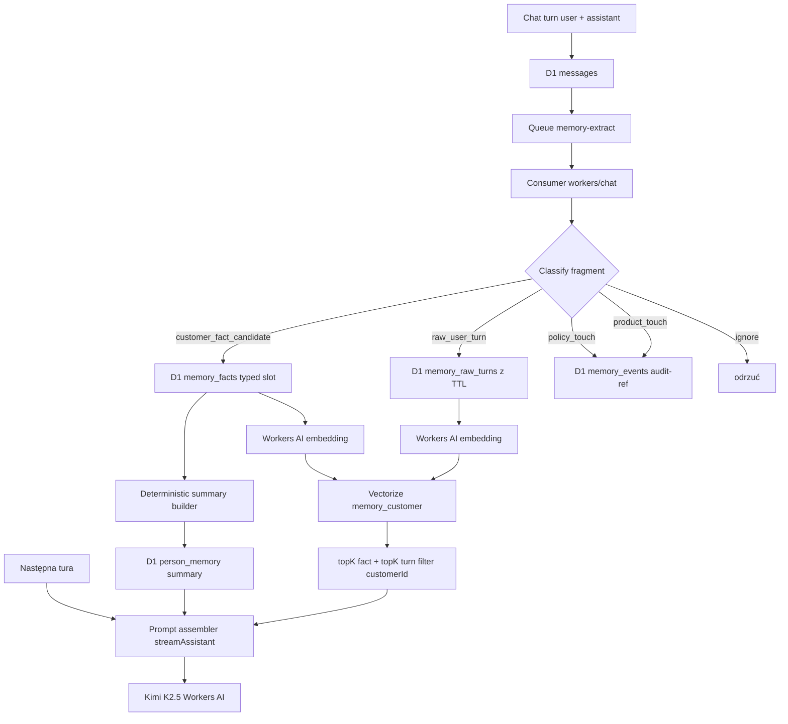

# EPIR Memory Architecture (semantyczna pamięć klienta)

> Dokument wchodzi do kanonicznego pakietu dokumentacji EPIR.
> Mirror NotebookLM musi trzymać 1:1 tę samą treść.
> Jeśli coś w tym dokumencie jest sprzeczne z `EPIR_AI_BIBLE.md`, `EPIR_AI_ECOSYSTEM_MASTER.md` lub `EPIR_KB_MCP_POLICY_CONTRACT.md` — pakiet bazowy wygrywa.

## Po co ten dokument

Opisuje docelową warstwę pamięci konwersacyjnej dla buyer-facing Gemmy w `workers/chat`: co jest źródłem prawdy, co trafia do D1, co do Vectorize, a czego tam być nie może (KB-clamp). Rozwiązuje konkretną awarię z logów 18.04.2026 00:19 UTC (pusta generacja Kimi K2.5 w `mergeSessionIntoPersonSummary`) i domyka Etap 3 (Queue + retry + DLQ + idempotentność).

Dev-asystent i `rag-worker` FAQ-fallback pozostają poza zakresem tego dokumentu.

## Zasady nienegocjowalne

1. **KB-clamp.** Treść polityk/FAQ sklepu żyje wyłącznie w Shopify Knowledge Base. Dostęp zawsze przez `search_shop_policies_and_faqs` (Storefront MCP). Indeks Vectorize `memory_customer` **nie zawiera** tekstu polityk — policy-touch to tylko `memory_events` (audit-ref). Patrz `docs/EPIR_KB_MCP_POLICY_CONTRACT.md`.
2. **Jedna aplikacja, jedno repo.** Schemat D1 i bindingi są wersjonowane wyłącznie w tym repo. Mirror NotebookLM nie trzyma odrębnej wersji.
3. **Deterministyczny skrót.** `person_memory.summary` buduje szablon, nie model. LLM wraca tylko jako opcjonalny enricher z twardym fallbackiem.
4. **Per-klient izolacja.** Każdy zapis w Vectorize ma metadane `{ customerId }`; retrieval zawsze z filtrem. Brak cross-customer wycieku embeddingów.
5. **GDPR.** TTL per slot, twardy TTL na raw turns, endpoint erasure i webhook `customers/redact`.

## Architektura



## Schemat D1

Tabele dodane migracjami `009_memory_facts.sql`, `010_memory_events.sql`, `011_memory_raw_turns.sql`:

- `memory_facts` — typed preferencje klienta (`slot`, `value`, `confidence`, `source_kind`, `expires_at`, `superseded_by`). UNIQUE `(customer, slot, value, source_message_id)` dla idempotencji.
- `memory_events` — audit-refs (`policy_touch`, `product_touch`, `cart_touch`, `faq_touch`). UNIQUE `(customer, tool_call_id)` gdy `tool_call_id` podany.
- `memory_raw_turns` — wyłącznie `role='user'`, z `text_masked` i twardym `expires_at`.
- `person_memory` (istniejąca) — nadal trzyma `summary`, ale od Etapu 3 pole to jest produktem deterministycznego buildera, nie LLM-merge.

## Vectorize `memory_customer`

- Binding: `[[vectorize]] binding = "MEMORY_INDEX" index_name = "memory_customer"` w `workers/chat/wrangler.toml`.
- Model embeddingu: `@cf/baai/bge-small-en-v1.5` (dimensions 384, metric `cosine`). Provisioning: `wrangler vectorize create memory_customer --dimensions=384 --metric=cosine`.
- Metadata: `{ customerId, kind: 'fact'|'turn', factId?, turnId?, slot?, createdAt }`.
- Retrieval zawsze z filtrem `{ customerId }` (plus opcjonalnie `kind`). KB-clamp egzekwowany w consumerze przed embedingiem.

## Pipeline async

- Kolejka `memory-extract` + DLQ `memory-extract-dlq`.
- Provisioning:
  ```
  wrangler queues create memory-extract
  wrangler queues create memory-extract-dlq
  ```
- `max_batch_size=10`, `max_batch_timeout=5s`, `max_retries=5`, `dead_letter_queue=memory-extract-dlq`.
- Producer: `streamAssistant` w `workers/chat/src/index.ts` po zakończeniu tury (gdy `MEMORY_EXTRACT_ENABLED=true`). Fallback inline gdy brak bindingu kolejki.
- Consumer: `export default.queue` w tym samym workerze, obsługiwany przez `workers/chat/src/memory/consumer.ts`.
- Idempotencja: `idempotencyKey = sha256(customerId:lastMessageTs)` (fallback FNV, gdy `crypto.subtle` niedostępne).

## KB-guard (moduł `workers/chat/src/memory/kb-guard.ts`)

Trzy reguły deterministyczne — uruchamiane przed LLM:

1. Wynik tool-calla `search_shop_policies_and_faqs` / `search_policies_and_faqs` → `policy_tool_result` (blokada).
2. Wypowiedź asystenta po policy-tool-call w tej samej turze → `policy_cited_assistant` (blokada).
3. Tekst pasujący do wzorców „polityka zwrotów / refund policy / regulamin sklepu / …” → `policy_text_like` (blokada).

Każda blokada emituje `chat.memory.kb_guard_blocked` z polem `reason`. Oczekiwana wartość licznika `kb_guard_policy_text_blocked_total` = 0 w normalnym ruchu; wzrost wskazuje regresję.

## Ekstraktor (`workers/chat/src/memory/extractor.ts`)

- Regex first-pass dla slotów twardych: `budget` (np. `2500 zł`), `ring_size` (`rozmiar 14`), `metal`, `stone`, `language`.
- LLM best-effort dla miękkich slotów: `style`, `intent`, `event`, `product_interest`. Timeout 2.5 s. Pusta generacja → `[]` (pipeline nie pada).
- Wynik → `MemoryFact` z TTL wg `FACT_SLOT_TTL_MS` (`ring_size`, `language` bez TTL; reszta od 30 do 365 dni).

## Deterministyczny skrót (`workers/chat/src/memory/summary-builder.ts`)

Bierze aktywne (niesuperseded, nieprzeterminowane) fakty, grupuje per slot, sortuje po `confidence desc` + `createdAt desc`, skleja w zwięzły akapit ≤700 znaków:

> `Preferencje zapamiętane: budżet: 2500 zł / 3000 zł; ulubione metale: srebro; ulubione kamienie: szafir; rozmiar: 14; styl: klasyczny; kontekst: engagement_ring.`

Gdy brak faktów → pusty string; prompt-assembler wtedy dokleja komunikat „brak potwierdzonych preferencji”.

## Prompt assembler v2 (flaga `MEMORY_V2_ENABLED`)

W `streamAssistant` po `crossSessionSummary`:

1. `luxury-system-prompt.ts` (bez zmian).
2. AI profile prompt (bez zmian).
3. `Kontekst systemowy — zapamiętane z wcześniejszych wizyt…` — z `person_memory.summary` (legacy lub deterministic).
4. `Kontekst systemowy — deterministyczny skrót preferencji klienta…` — z `memory_facts` per tura (MEMORY_V2_ENABLED).
5. `<customer_facts_retrieved>` — top-k `memory_facts` z Vectorize, twardy cap 600 znaków.
6. `<customer_turns_retrieved>` — top-k `memory_raw_turns` (gdy `MEMORY_RAW_RETRIEVAL_ENABLED=true`), cap 400 znaków.
7. Gdy brak jakichkolwiek potwierdzonych preferencji — jawny komunikat „nie udawaj, że pamiętasz”.
8. Historia tury, wiadomość użytkownika.

## Privacy i GDPR

- TTL per slot z `FACT_SLOT_TTL_MS` w `memory/types.ts`.
- `memory_raw_turns.expires_at` = `now + 180 dni`; cleanup przez cron/scheduled handler (`deleteExpiredMemoryRawTurns`).
- Endpoint `DELETE /memory/customer/{customerId}` (autoryzacja `X-Admin-Key: ADMIN_KEY`) kasuje fakty, eventy, raw turns i wektory.
- Webhook Shopify `POST /webhooks/customers/redact` (HMAC SHA-256 z `SHOPIFY_APP_SECRET`) woła ten sam `eraseCustomerMemory`.
- `maskPII` (e-mail / telefon / karta / PESEL) uruchamia się przed embedingiem; tekst zapisywany do `memory_raw_turns` również przechodzi maskowanie (`text_masked=1`).

## Metryki

Wszystkie z tagiem `chat.memory` (ustrukturyzowany JSON w `console.log`):

- `phase=extract` — `latency_ms`, `facts_new`, `facts_dedup`, `events_new`, `raw_turns_indexed`, `vectors_upserted`.
- `phase=extract_failure` — `error`, `retry` (przy retry'u Queue).
- `phase=embed` — `latency_ms`, `model`, `masked`, `chars`; `phase=embed_failure` — `error`, `model`.
- `phase=retrieve` — `latency_ms`, `topk_hits`, `kind`.
- `phase=summary_build` — `source` ∈ `{deterministic, llm_enriched, fallback}`.
- `phase=kb_guard_blocked` — `reason`, `role`, `tool_name`. Oczekiwana wartość 0.
- `phase=queue_enqueue` / `queue_dlq` / `erasure`.

## Feature flagi (per storefront `[vars]` w `wrangler.toml`)

- `MEMORY_EXTRACT_ENABLED` — włącza enqueue do `memory-extract` w `streamAssistant`. Przy `false` obowiązuje dotychczasowy `refreshPersonMemoryAtomic`.
- `MEMORY_V2_ENABLED` — włącza deterministyczny skrót + retrieval w prompt assemblerze.
- `MEMORY_RAW_RETRIEVAL_ENABLED` — dodatkowo top-k po `memory_raw_turns`.

## Migracja

1. Zastosuj migracje: `wrangler d1 execute ai-assistant-sessions-db --file=workers/chat/migrations/009_memory_facts.sql` (i kolejne 010, 011).
2. Provisioning kolejek i Vectorize (polecenia powyżej).
3. Odkomentuj bloki `[[queues.producers]]`, `[[queues.consumers]]`, `[[vectorize]]` w `workers/chat/wrangler.toml`.
4. Deploy worker (`wrangler deploy`).
5. Backfill: `npx wrangler d1 execute ai-assistant-sessions-db --command="SELECT shopify_customer_id, summary FROM person_memory WHERE LENGTH(TRIM(summary)) > 50" --json > /tmp/pm.json && tsx workers/chat/scripts/backfill-memory-facts.ts /tmp/pm.json > /tmp/backfill.sql && wrangler d1 execute ai-assistant-sessions-db --file=/tmp/backfill.sql`.
6. Włącz `MEMORY_EXTRACT_ENABLED=true` (shadow — consumer działa, ale assembler jeszcze stary).
7. Po 48 h obserwacji metryk (`extract_latency_ms`, `summary_source`, `kb_guard_blocked_total`) — włącz `MEMORY_V2_ENABLED=true` dla 5% → 25% → 100% klientów (rollout ręczny przez vars override w wranglerze).

## Co rozwiązuje awarię z 18.04.2026

- `person_memory.summary` buduje szablon z `memory_facts` — pusta generacja Kimi K2.5 w `getGroqResponse` nie blokuje produkcji.
- `refreshPersonMemoryAtomic` nie zwraca już `ok:false` userowi — staje się enqueue do kolejki, realny update w tle.
- „Zimna pamięć” w pierwszej turze: jawny komunikat systemowy zamiast halucynacji „widzę, że rozmawialiśmy wcześniej”.

## Ograniczenia i ryzyka

- Zmiana modelu embeddingowego wymusi reindeks wszystkich klientów (koszt proporcjonalny do `memory_facts` + `memory_raw_turns`).
- LLM-extractor może mieć ten sam problem pustej generacji co merge — mitigacja: deterministyczny regex first-pass zawsze odpala (patrz `extractFactsDeterministic`).
- TTL per slot może skasować fakt, który klient nadal uznaje za aktualny — rozwiązanie: `soft-expire` (odpytanie w rozmowie zamiast twardego delete) jest backlogiem poza zakresem.
- Token-budget w assemblerze jest kontrolowany przez twarde capy 600/400 znaków; gdy system prompt przekracza 7 k tokenów — metryka i kompaktowanie w kolejnym PR.
