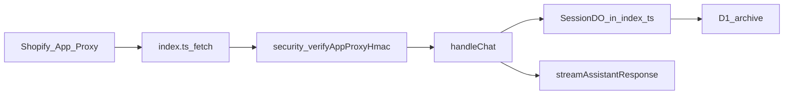

# Pliki do poznania przed projektem MVP „pamięć międzysesyjna”

**Cel:** mapa faktycznych ścieżek w `workers/chat` (i powiązanych) dla projektowania MVP pamięci ponad jedną sesją — bez zakładania osobnych plików `handleChat.ts` / `session-do.ts`, których w tym repozytorium nie ma.

**Powiązanie:** [NOTEBOOKLM_EPIR_CHAT_INGRESS.md §8](NOTEBOOKLM_EPIR_CHAT_INGRESS.md) (kontrakt: historia sesji vs zamówienia vs obietnice promptu).

---

## Korekta względem typowych nazw plików

- **`handleChat` i `streamAssistantResponse` nie są w osobnym `handleChat.ts`.** Cała logika routingu czatu, klasy **`SessionDO`**, **`handleChat`**, **`streamAssistantResponse`** oraz fetch do `https://session/history` siedzi w jednym pliku: [`workers/chat/src/index.ts`](../workers/chat/src/index.ts) (duży plik — czytaj sekcjami lub wyszukiwanie symboli).
- **SessionDO nie jest w `session-do.ts`.** Implementacja to **`export class SessionDO`** w [`workers/chat/src/index.ts`](../workers/chat/src/index.ts) (ścieżki typu `/session/history`, `/session/set-customer`, itd.).
- **Testy nie są w `src/__tests__`.** Katalog: [`workers/chat/test/`](../workers/chat/test/) (Vitest).

---

## A. Entry + trasy (Ingress → czat)

| Potrzeba | Miejsce w repo |
|----------|----------------|
| `POST /apps/assistant/chat`, `POST /chat`, HMAC, replay | [`workers/chat/src/index.ts`](../workers/chat/src/index.ts) — początek pliku + routing przed `handleChat` |
| `verifyAppProxyHmac` | [`workers/chat/src/security.ts`](../workers/chat/src/security.ts) |
| Bindingi DO / D1 | [`workers/chat/wrangler.toml`](../workers/chat/wrangler.toml), [`workers/chat/src/config/bindings.ts`](../workers/chat/src/config/bindings.ts) |

**Szybkie kotwice w `index.ts` (orientacyjnie):** klasa `SessionDO` ~L398; `handleChat` ~L669; `customerId` z `url.searchParams.get('logged_in_customer_id')` ~L716; `streamAssistantResponse` ~L852; fetch `https://session/history` ~L889.

---

## B. Handler rozmowy („handleChat.ts” w cudzysłowie)

**Jeden plik:** [`workers/chat/src/index.ts`](../workers/chat/src/index.ts)

- Szukaj: `async function handleChat`, `async function streamAssistantResponse`.
- Zawiera: parsowanie body, `session_id`, streaming, stub SessionDO, budowa historii dla modelu, filtrowanie narzędzi (`run_analytics_query` tylko dla `internal-dashboard`).

Pomocniczo:

- Przycinanie historii: [`workers/chat/src/utils/history.ts`](../workers/chat/src/utils/history.ts) (`MAX_HISTORY_FOR_AI`, `truncateWithSummary`).
- Prompt systemowy: [`workers/chat/src/prompts/luxury-system-prompt.ts`](../workers/chat/src/prompts/luxury-system-prompt.ts) (import w `index.ts`).

---

## C. SessionDO — historia sesji

**Implementacja:** klasa **`SessionDO`** w [`workers/chat/src/index.ts`](../workers/chat/src/index.ts).

- Szukaj handlerów na pseudo-URL `https://session/...` (np. `/session/history`, `/session/set-session-id`, `/session/set-customer`).
- Archiwizacja do D1 — fragmenty z logiem `[SessionDO]` w tym samym pliku.

**Testy:** [`workers/chat/test/session_do.test.ts`](../workers/chat/test/session_do.test.ts).

---

## D. Identyfikacja klienta (`customerId`)

**Źródło `customerId` przy App Proxy (stan na dziś):** w `handleChat` w [`workers/chat/src/index.ts`](../workers/chat/src/index.ts) — **query param** `logged_in_customer_id` (Shopify dokleja przy forwardzie App Proxy).

Dodatkowo:

- Profil z Shopify: [`workers/chat/src/shopify-mcp-client.ts`](../workers/chat/src/shopify-mcp-client.ts) (`getCustomerById`).
- **TokenVault:** [`workers/chat/src/token-vault.ts`](../workers/chat/src/token-vault.ts).
- Test: [`workers/chat/test/session_customer.test.ts`](../workers/chat/test/session_customer.test.ts).

---

## E. D1 / stan globalny — istniejące tabele (nie od zera)

| Obszar | Plik |
|--------|------|
| Schemat bazowy (`sessions`, `customer_profiles`, `messages`, …) | [`workers/chat/schema.sql`](../workers/chat/schema.sql) |
| Migracja **`client_profiles`** (Golden Record, `ai_context`, `preferences`) | [`workers/chat/migrations/002_client_profiles.sql`](../workers/chat/migrations/002_client_profiles.sql) |
| **`ProfileService`** (upsert `client_profiles` w `DB_CHATBOT`) | [`workers/chat/src/profile.ts`](../workers/chat/src/profile.ts) |
| Pozostałe migracje | [`workers/chat/migrations/`](../workers/chat/migrations/) |

**Stan MVP (wdrożone):** tabela `person_memory` w `DB_CHATBOT` — migracja [`workers/chat/migrations/004_person_memory.sql`](../workers/chat/migrations/004_person_memory.sql), logika [`workers/chat/src/person-memory.ts`](../workers/chat/src/person-memory.ts). `person_id` = `logged_in_customer_id` (Shopify). Tabele `client_profiles` / Golden Record pozostają osobno (pixel `client_id`).

---

## F. Prompty („pamięć” w tekście)

- [`workers/chat/src/prompts/luxury-system-prompt.ts`](../workers/chat/src/prompts/luxury-system-prompt.ts) — sekcje PAMIĘĆ / dłuższy komentarz w `LUXURY_SYSTEM_PROMPT_V2_FULL`.
- Kontrakt dokumentowy: [`NOTEBOOKLM_EPIR_CHAT_INGRESS.md`](NOTEBOOKLM_EPIR_CHAT_INGRESS.md) §8.

---

## G. Testy (kontraktów nie psuć)

- [`workers/chat/test/session_customer.test.ts`](../workers/chat/test/session_customer.test.ts)
- [`workers/chat/test/session_do.test.ts`](../workers/chat/test/session_do.test.ts)
- [`workers/chat/test/app_proxy_ingress_hmac.test.ts`](../workers/chat/test/app_proxy_ingress_hmac.test.ts), [`workers/chat/test/ingress_s2s.test.ts`](../workers/chat/test/ingress_s2s.test.ts) — przy zmianach wejścia
- [`workers/chat/test/prompt_tool_names.test.ts`](../workers/chat/test/prompt_tool_names.test.ts) — przy zmianach narzędzi

---

## Absolutne minimum (core)

1. [`workers/chat/src/index.ts`](../workers/chat/src/index.ts) — routing `POST /apps/assistant/chat` → `handleChat` → `streamAssistantResponse` + `SessionDO` + `/session/history`.
2. Ten sam plik — `logged_in_customer_id` + zapis klienta do DO.
3. [`workers/chat/schema.sql`](../workers/chat/schema.sql) + [`workers/chat/migrations/002_client_profiles.sql`](../workers/chat/migrations/002_client_profiles.sql).
4. [`workers/chat/src/prompts/luxury-system-prompt.ts`](../workers/chat/src/prompts/luxury-system-prompt.ts).
5. [`workers/chat/test/session_customer.test.ts`](../workers/chat/test/session_customer.test.ts).

---

## Przepływ (skrót)

---

## Następny krok (poza listą plików)

Decyzja produktowa: **jeden stabilny `person_id`** (np. tylko zalogowany `customer_id` vs gość z `client_id` z Pixela) oraz czy MVP wstrzykuje skondensowaną pamięć z **`client_profiles.ai_context`** vs nowa kolumna/tabela — spójność między [`schema.sql`](../workers/chat/schema.sql), [`002_client_profiles.sql`](../workers/chat/migrations/002_client_profiles.sql) a ścieżką `logged_in_customer_id` w [`index.ts`](../workers/chat/src/index.ts).

---

*Dokument pomocniczy dla implementacji MVP; aktualizuj przy zmianach w `workers/chat/src/index.ts` lub schemacie D1.*
