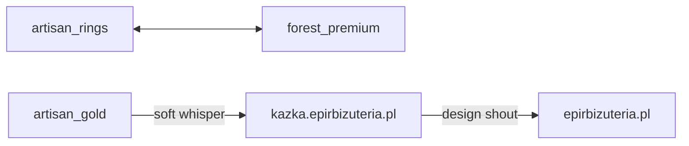

# Genialny plan Cursor Groka 4.5

**Status:** materiał roboczy (mirror 1:1 z repo / NotebookLM). Niewiążący do czasu weryfikacji i wchłonięcia do kanonu.  
**Data:** 2026-08-12  
**Czytaj też:** [`LANDINGS_APEX_HANDOFF.md`](LANDINGS_APEX_HANDOFF.md), [`FEED_AND_STORE_STRUCTURE.md`](FEED_AND_STORE_STRUCTURE.md), [`docs/kb/DESIGN_TOKENS.md`](../kb/DESIGN_TOKENS.md), [`EPIR_STOREFRONT_DOMAIN_STRATEGY.md`](../EPIR_STOREFRONT_DOMAIN_STRATEGY.md)

## Cel

Uporządkować Tor Apex Ads: zamiast pięciu powielających się landingów — **trzy aktywne** według intencji zakupowej, plus **asymetryczne mosty** EPIR ↔ Kazka (osobne storefronty, bez mieszania katalogu).

Ten dokument jest SSOT decyzji strategicznych do dalszej pracy. **Nie** zastępuje handoffu operacyjnego (`LANDINGS_APEX_HANDOFF.md`).

## Problem

- Pięć `utm_campaign` → pięć landingów, z czego cztery apexowe dzielą ten sam szablon (`SHARED_PROCESS`, ten sam manifesto).
- `artisan_new` nie jest intencją zakupową (NOWOŚCI = mechanizm operacyjny sklepu, nie byt reklamowy).
- Kazka to osobny, drogi storefront — nie „droższa półka” w siatce EPIR.

## Model: 3 aktywne landingu

| # | Intencja | `utm_campaign` | Metaobject (istniejący) | Rola |
|---|----------|----------------|-------------------------|------|
| 1 | Pierścionki srebrne | `artisan_rings` | `artisan-rings-landing` | Siatka + CTA pierścionków; most → reszta srebra |
| 2 | Reszta srebra | `forest_premium` | `forest-premium-landing` | Bransolety, kolczyki, wisory/naszyjniki, bestsellery; most → pierścionki |
| 3 | Złoto EPIR (rzeźba / projekt) | `artisan_gold` | `artisan-gold-landing` | Złoto rzemieślnicze; soft most → Kazka |

Zgodność z kategoriami podstawowymi sklepu: pierścionki/obrączki srebrne vs pozostałe srebro vs biżuteria złota (bez podziału wewnętrznego).

### Deprecated / rezerwa

| Klucz | Status | Uwagi |
|-------|--------|--------|
| `artisan_new` | **Usunięty z routingu kodu** | Brak w `landing-copy` / preview / `APEX_MAPPING`; seed: `APEX_MAPPING_REMOVED_KEYS`. Metaobject w Shopify może zostać martwy do cleanup. |
| `organic_art` | **Rezerwa** | Marka + współtworzenie; nie czwarty aktywny URL w Ads na start |

## Mosty (asymetria marek)



### Srebro ↔ srebro (obowiązkowe)

Nawigacja oferty — **nie** A/B.

- Na `artisan_rings`, pod siatką: most do reszty srebra (`forest_premium` lub bezpośredni URL kolekcji na `epirbizuteria.pl`).
- Na `forest_premium`, pod siatką: most do pierścionków (`artisan_rings` / kolekcja pierścionków).

### EPIR złoto → Kazka (szept)

- **Gdzie:** jedna sekcja na samym dole landingu `artisan_gold` (po ofercie EPIR i CTA współtworzenia).
- **Co:** tylko tekst + jeden link na `https://kazka.epirbizuteria.pl` — **zero** produktów Kazki w siatce EPIR.
- **Framing:** klasyka połączona z nowoczesnością; złoto i brylanty; osobna rzemieślnicza pracownia z Wrocławia.
- **Cel:** side door + halo prestiżu wokół EPIR; **nie** główny lejek Kazki.
- Atrybucja linku (sugerowana): osobne UTM, np. `utm_source=epir_landing&utm_campaign=artisan_gold_to_kazka`.

### Kazka → EPIR organika (głośny design shout)

- **Gdzie:** sekcja **nad footerem** w `apps/kazka` — nie kolejny link w nav (header już ma miękkie „Cały sklep →”).
- **Jak „krzyczeć”:** duża typografia, mocny kontrast, pełna szerokość, **jeden** CTA — design shout, nie promo shout.
- **Copy (2026-08-12):** „Szukasz organicznej rzeźby w **złocie**?” — żywa powierzchnia / forma leśna; brylant i inne kamienie szlachetne; srebro tylko jako ten sam język, nie tańsza ścieżka. **Bez** słowa „niedoskonałość”.
- **Link:** `https://epirbizuteria.pl/collections/zlota-bizuteria` (+ UTM bridge), nie home.
- **Zakaz:** siatka produktów EPIR na Kazce; sticky / pop-up; porównania cen; „tańsza linia”.

## Ads / PMax / Kazka

| Ruch | Cel |
|------|-----|
| Search — pierścionki / obrączki (styl EPIR) | `utm_campaign=artisan_rings` |
| Search — kolczyki / bransolety / wisory / srebro ogólne | `utm_campaign=forest_premium` |
| Search — złoto EPIR / artystyczne / projekt | `utm_campaign=artisan_gold` |
| Search / Ads — złoto + brylant / klasyka | **Bezpośrednio** `kazka.epirbizuteria.pl` |
| PMax Shopping | URL **produktów** z GMC (nie HTML landingu); UTM atrybucyjny może zostać |

- Feed GMC EPIR: Kazka nadal wyłączona (`-tag:kazka` / vendor).
- Heurystyka `planSearchAdGroupSuffixes` w marketing-ingest — zsynchronizować z trzema aktywnymi kluczami (bez `artisan_new` / bez `organic_art` jako domyślnych).

## Guardrails copy / marki

SSOT: [`EPIR_COPY_PHILOSOPHY.md`](EPIR_COPY_PHILOSOPHY.md) — **język marki EPIR Art Jewellery** (default total). Reguła Cursor: `.cursor/rules/epir-copywriting.mdc` (`alwaysApply`); przy Kazce: `epir-hydrogen-storefronts.mdc`.

### Pięć zasad EPIR

1. Cień, nie figura — przy niej, nie przed nią.
2. Żywa powierzchnia — ślad procesu; **zakaz** *niedoskonałość* (wada).
3. Warsztat na skórze — haptyka zamiast klisz luksusu.
4. Organika tak samo szlachetna — złoto / brylant w rzeźbie; nie tańsza linia vs Kazka.
5. Default EPIR totalnie — wyjątek tylko przy wyraźnej pracy nad Kazka Jewelry.

| Marka | Język |
|-------|--------|
| **EPIR** | 5 zasad powyżej; Gemma, sklep, landingu, Zaręczyny, Inspiracje |
| **Kazka** | ostry minimalizm, geometryczny spokój, złoto i brylanty — **osobny** ToV |

W mostach **nie** używać: „nasza druga marka”, „tańsza / droższa linia”, mieszania katalogów, „niedoskonałość”.

## Kolejność wdrożenia

1. [x] Zapis docs (ten plik + `docs/README.md` + `LANDINGS_APEX_HANDOFF.md`)
2. [x] Architektura wizualna v1 (LCP `<picture>`, tekstura CSS, mosty) — kod w repo + deploy 2026-08-12
3. [x] Soft most EPIR złoto → Kazka (`artisan_gold`)
4. [x] Głośny most Kazka → EPIR (`apps/kazka/app/components/OrganicEpirBridge.tsx`)
5. [x] Mosty srebro ↔ srebro (`artisan_rings` ↔ `forest_premium`)
6. [x] **Kanibalizacja makiet LP** → copy + sekcje Foundry / Authority / grawer / Digital Co-creation (2026-08-12)
7. [ ] Synchronizacja Google Ads / `planSearchAdGroupSuffixes` — **nie ruszać bez zgody operatora**
8. [x] Deploy workera + Kazka Pages (2026-08-12); `LANDINGS_ENABLED=true` na `l.` — **Ads nadal wyłączone** (brak Final URL na landingu)
9. [ ] **Następny wątek:** grafiki Hero (2048×2048), tekstury organiczne (len/kora)

## Stan live (2026-08-12)

Podgląd bez ruchu z Ads (bezpośrednie URL):

| Co | URL |
|----|-----|
| Złoto + most Kazka | `https://l.epirbizuteria.pl/?utm_campaign=artisan_gold` |
| Pierścionki srebrne | `https://l.epirbizuteria.pl/?utm_campaign=artisan_rings` |
| Reszta srebra | `https://l.epirbizuteria.pl/?utm_campaign=forest_premium` |
| Kazka → EPIR (shout) | `https://kazka.epirbizuteria.pl/` (sekcja nad footerem) |

Deploy: `cd workers/dynamic-landing-liquid && npx wrangler deploy --env=""`  
Kazka Pages: **`npm run deploy -w kazka`** (nie root `pages:deploy:kazka` — konflikt zod w lokalnym wranglerze workspace).

## Mapa kodu (architektura wizualna — nie szukać od zera)

| Moduł | Plik | Rola |
|-------|------|------|
| CDN width / srcset | `workers/dynamic-landing-liquid/src/shopify-cdn.ts` | `?width=` na Shopify CDN |
| Hero `<picture>` LCP | `workers/dynamic-landing-liquid/src/hero-picture.ts` | `fetchpriority="high"`, breakpointy 768/1280/1600 |
| Makro / Hero po handle | `workers/dynamic-landing-liquid/src/stone-profile-hero.ts` | override map → media alt `stone_profile` → `featuredImage` |
| Tekstura CSS | `workers/dynamic-landing-liquid/src/render-shared.ts` | `.grain-overlay`, `.texture-organic`, `.kazka-bridge` |
| Mosty HTML | `workers/dynamic-landing-liquid/src/landing-sections.ts` | `renderKazkaBridge`, `renderSilverCrossBridge` |
| Renderer 3 aktywnych | `workers/dynamic-landing-liquid/src/render-apex-editorial.ts` | rings / forest / gold |
| Rezerwa co-create | `workers/dynamic-landing-liquid/src/render-organic-art.ts` | `organic_art` |
| Kazka bridge | `apps/kazka/app/components/OrganicEpirBridge.tsx` | nad `<Footer />` w `root.tsx` |
| Testy | `workers/dynamic-landing-liquid/test/hero-visual.test.ts`, `worker.test.ts` | |

**Uwaga domenowa:** `custom.stone_profile` w Shopify = metaobject gemmologiczny (JSON-LD), **nie** plik makro. Makro Hero = media produktu (alt/filename) lub mapa `STONE_PROFILE_CDN_BY_HANDLE` w `stone-profile-hero.ts`. Plik `products_export_notebooklm.md` **nie istnieje w repo** — URL-e override uzupełniać ręcznie lub z eksportu Admin.

## Następny wątek: grafiki i tekstury (otwarte)

Zgodnie z [`docs/kb/DESIGN_TOKENS.md`](../kb/DESIGN_TOKENS.md) i [`REVIEW.md`](../../REVIEW.md):

- **Hero 2048×2048** — lifestyle / makro kamienia (`stone_profile` jako ujęcie produktowe, nie metafield gemmologiczny); podpiąć pod `resolveHeroImage` / pola metaobiektu `campaign_landing` (hero image — patrz handoff).
- **Tekstury** — dziś tylko SVG noise + `mix-blend-mode` (`.texture-organic`); docelowo opcjonalnie `texture_overlay` z kolekcji (`collection_enhanced`) — bez ciężkich PNG w workerze, chyba że operator dostarczy zoptymalizowane WebP z CDN Shopify Files.
- **organic_art** — hero nadal placeholder gdy brak kuracji z obrazem; priorytet Ads: 3 landingu z genialnego planu.

## Nowy wątek Cursor — prompt startowy

```
Czytaj docs/working/GENIALNY_PLAN_CURSOR_GROKA_4_5.md oraz docs/working/LANDINGS_APEX_HANDOFF.md.
Landingu 3 aktywne + mosty są wdrożone (2026-08-12). Ads NIE włączać bez zgody.
Następny krok: grafiki Hero 2048 i tekstury organiczne — mapa kodu w GENIALNY_PLAN § „Mapa kodu”.
Bez deployu bez mojej zgody.
```
